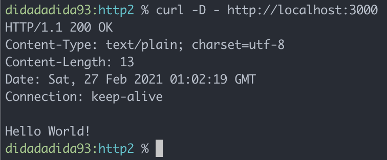
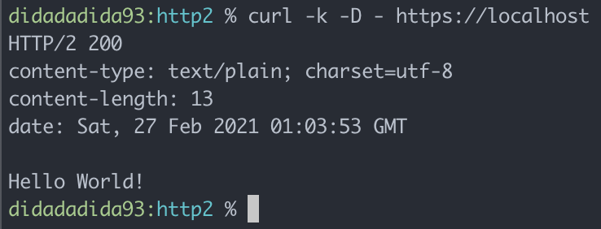
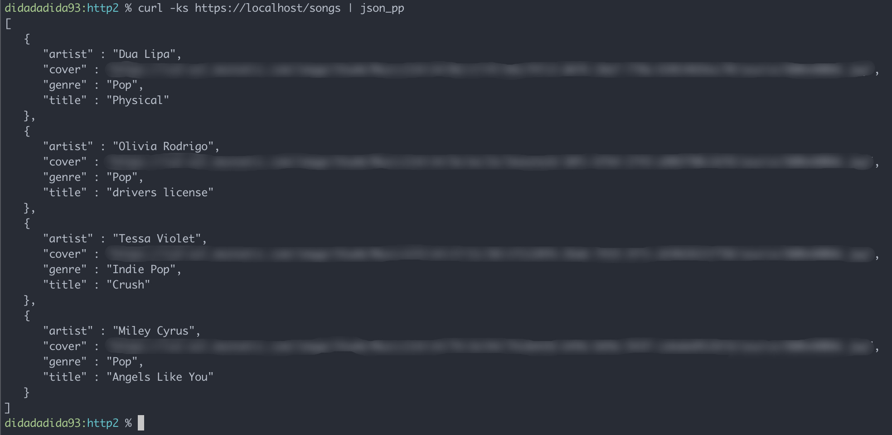

import Figcaption from "../../components/Figcaption"

It's been a year (give or take) I've using [Express](https://expressjs.com) and I just realized that Express still using HTTP/1.x.


<Figcaption><span>Photo by <a href="https://unsplash.com/@alternateskate?utm_source=unsplash&amp;utm_medium=referral&amp;utm_content=creditCopyText">Alternate Skate</a> on <a href="https://unsplash.com/?utm_source=unsplash&amp;utm_medium=referral&amp;utm_content=creditCopyText">Unsplash</a></span></Figcaption>

### Then How to Create HTTP/2 Server on NodeJs?
Once I know that Express still using HTTP/1.x, I start searching on _google_ which framework that use HTTP/2 protocol on NodeJs. Then I found [KoaJs](https://koajs.com/). Withouth further a do, I read the documentation and come up with this simple Koa app.

```js
const Koa = require("koa")
const app = new Koa()
const port = process.env.PORT || 80

app.use(async ctx => {
  ctx.body = "Hello World!\n"
})

app.listen(port, () => console.log("listening on port %i", port))
```

But when I run the server and make a request, it still use HTTP/1.x


<br />

I found that `app.listen` is a _syntatic sugar_ for running nodejs http module, so the code will be something like this

```js {1,10-12}
const http = require("http")
const Koa = require("koa")
const app = new Koa()
const port = process.env.PORT || 80

app.use(async ctx => {
  ctx.body = "Hello World!\n"
})

http
  .createServer(app.callback())
  .listen(port, () => console.log("listening on port %i", port))
```
<br />

Alright, so I know I can't use `app.listen` to start a server. So if I want to run http/2 server, then I need to modify the script a little bit so it start http/2 server.

```js {1-2,11-14,16-17}
const fs = require("fs")
const http2 = require("http2")
const Koa = require("koa")
const app = new Koa()
const port = process.env.PORT || 80

app.use(async ctx => {
  ctx.body = "Hello World!\n"
})

const options = {
  key: fs.readFileSync("./private.key"),
  cert: fs.readFileSync("./cert.crt")
}

http2
  .createSecureServer(options, app.callback())
  .listen(port, () => console.log("listening on port %i", port))
```
<br />

> Please note that http2 module required you to run on HTTPS protocol so you need SSL certificate. There is a lot of article that help you to generate self-signed SSL certificate for development purpose.


<br />

### Let's Create Simple Rest API
By default, KoaJs didn't have method for define HTTP verb like ExpressJs. So if I want to create simple rest API using KoaJs but want to feel it like I'm using ExpressJs, I have to install _middleware_ to add this functionality.

[In here](https://github.com/koajs/koa/wiki) you will find a lot of _middleware_ that can be use for KoaJs application. As for now I will use [@koa/router](https://github.com/koajs/router) since this module is provided by KoaJs. I update the code so it look like this

```js {4,8,10-15,17}
const fs = require("fs")
const http2 = require("http2")
const Koa = require("koa")
const Router = require("@koa/router")
const port = process.env.PORT || 443

const app = new Koa()
const router = new Router()

router.get("/", (ctx, next) => {
  ctx.body = { status: "Running!" }
})
router.get("/songs", (ctx, next) => {
  ctx.body = JSON.parse(fs.readFileSync("./songs.json"))
})

app.use(router.routes())

const options = {
  key: fs.readFileSync("./private.key"),
  cert: fs.readFileSync("./cert.crt")
}

http2
  .createSecureServer(options, app.callback())
  .listen(port, () => console.log("listening on port %i", port))
```
<br />

And here is the response from the route that I just made.


<br />

Now we can add new routes just like we using ExpressJs. Yeay 🤩
