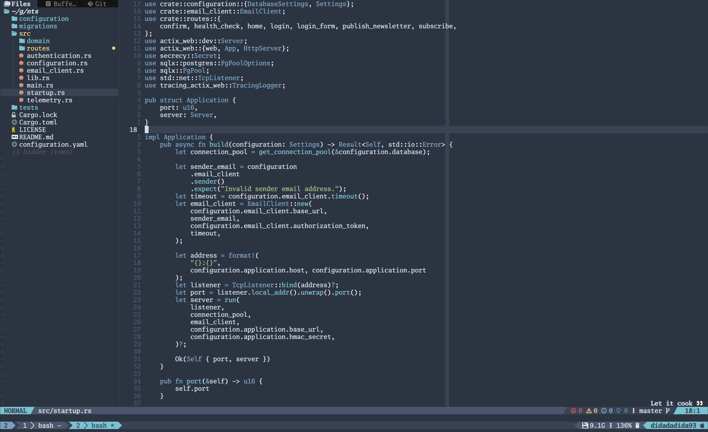

import Figcaption from "../../components/Figcaption"

Setup text editor bring my memory back on how fun coding was.

<Figcaption>Photo by <a href="https://unsplash.com/@josiahgardner?utm_source=unsplash&utm_medium=referral&utm_content=creditCopyText">Josiah Gardner</a> on <a href="https://unsplash.com/photos/Tb9FJ4Znz-U?utm_source=unsplash&utm_medium=referral&utm_content=creditCopyText">Unsplash</a></Figcaption>

### The Beginning
I remember first time I decided to use [Vim](https://www.vim.org/). It was 2020 when I was studying at a [bootcamp](https://www.hacktiv8.com/) in Jakarta. It was because one of my instructor use it during our class.

_And damn he looks cool..._

I code everyday during my time at bootcamp. It was so intense until I felt it is not so efficient to move around my code using mouse.
And I started to like the idea on maximizing efficiency by omiting mouse and using keyboard to move around.
And that's it, I'm using Vim since then.

### Re-interpretation
TBH using Vim with several plugins is enough for me. But it would be great if Vim can help me during coding.
Using [my old configuration](https://github.com/didadadida93/dotfiles/blob/4014de49529c3cad5290e904bb647aeb4c9b99ac/macos/.vimrc), I've never utilize [LSP](https://microsoft.github.io/language-server-protocol/). It is due the fact that Vim is quite old and it is a bit tricky to use latest feature such as LSP.  
So I decided to use [Neovim](https://neovim.io/), Vim but more modern.  
And I know customizing text editor such as Neovim will be time consuming because the nature of Neovim that is fully customize to everyone needs.

_This is modern day, there should be something that can make my life easy..._

Turn out, there are a lot of starter templates, easy to install, fire and go, fully customize with sane config Neovim configs.  
Here are some starter templates that I found :

- [kickstart.nvim](https://github.com/nvim-lua/kickstart.nvim)
- [LazyVim](https://www.lazyvim.org/)
- [AstroNvim](https://astronvim.com/)
- [LunarVim](https://www.lunarvim.org/)
- [CosmicNvim](https://cosmicnvim.vercel.app/)
- [NvChad](https://nvchad.com/)

Pick your poison but I choose [kickstart.nvim](https://github.com/nvim-lua/kickstart.nvim) because it have minimal plugins to get me run.  
After I spent my 2 days to customize kickstart.nvim, it's finally done. You could [check this link](https://github.com/didadadida93/kickstart.nvim) to see my configuration. Here is a sneek peek on how it looks.

<Figcaption>Poisoned by my own taste</Figcaption>
