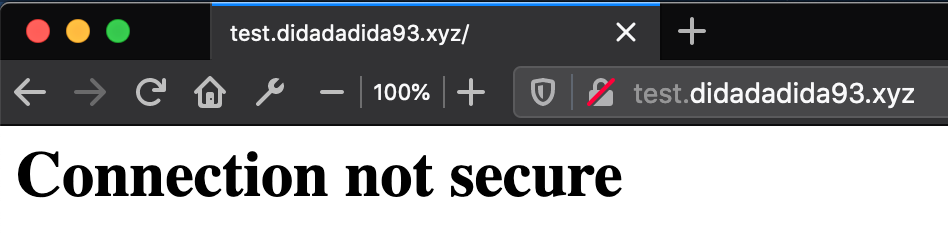
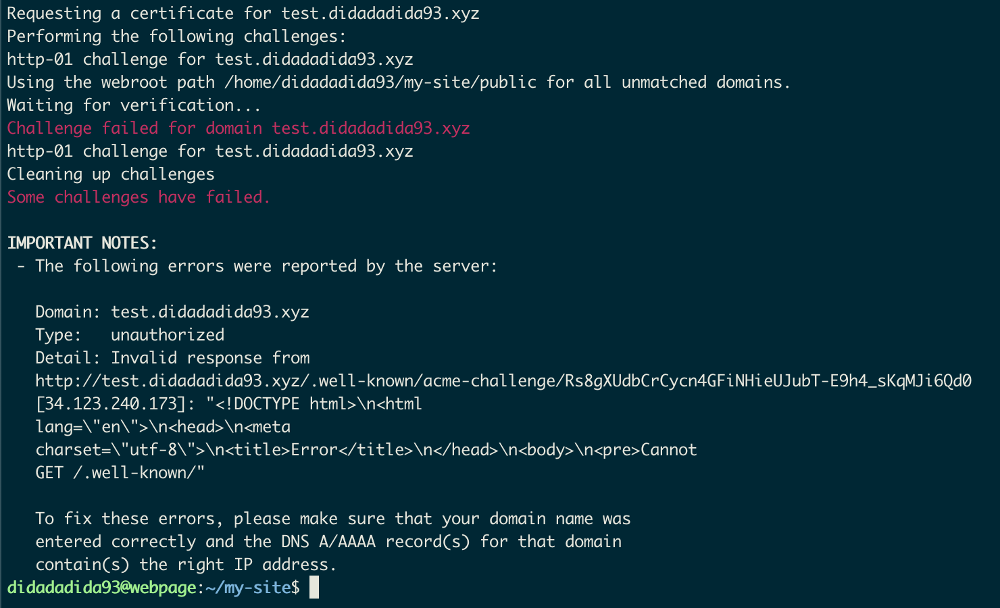
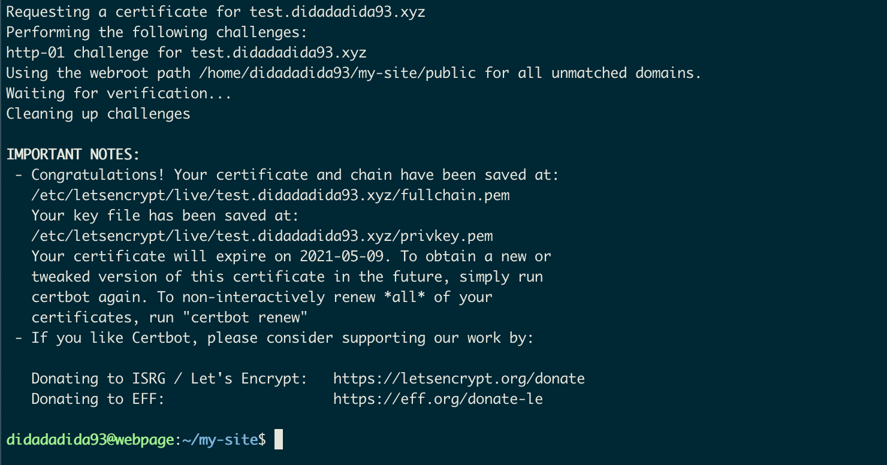
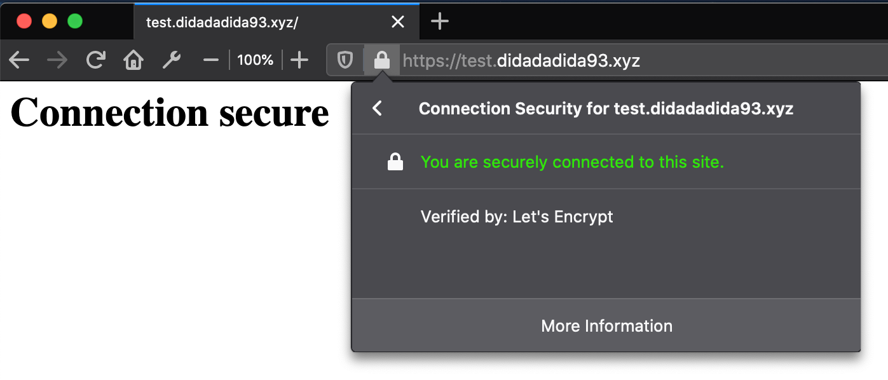

import Figcaption from "../../components/Figcaption"

It is easy to setup [Express](https://expressjs.com) web app to run on http server, but what if we want to run it on https?


<Figcaption><span>Photo by <a href="https://unsplash.com/@chrispanas?utm_source=unsplash&amp;utm_medium=referral&amp;utm_content=creditCopyText">chris panas</a> on <a href="https://unsplash.com/s/photos/lock?utm_source=unsplash&amp;utm_medium=referral&amp;utm_content=creditCopyText">Unsplash</a></span></Figcaption>

### What is HTTPS?
HTTPS is secure version of HTTP that use SSL/TLS Protocol for authentication and encryption. What it mean by authentication is the server verified himself by providing SSL/TLS certificate that say the server is who they say they are so the client can trust the server. Furthemore the data that being sent from the server and client will be encrypted to keep it secure from eavesdroppers. So it's **important** to use HTTPS on your server.

### Obtaining Certificate
A Webserver can obtain their digital certificates from trusted third parties called certificate authorities (CAs). [Certbot](https://certbot.eff.org/about/) is a tool for webserver administrator to obtain digital certificate that signed by [Let's Encrypt](https://letsencrypt.org/about/) certificate authority (CA).

> There is a lot of certificate authorities (CAs) out there, but the reason why choose Let's Encrypt is because it is **open** and (of course) **free**.

To use certbot for obtaining certificate you can use `certonly` command. And the following plugin can be used based on your condition

* `--webroot` plugin can be added if you already have running server and you'd prefer not to stop it. By using this plugin you need to specify top-level directory ("web root") containing the files served by your server using `--webroot-path` argument (or `-w` for short)
* `--standalone` plugin can be added if your application are not running. By using this plugin, the certbot will start their own server and listening on port 80 in order to perform domain validation.
* `--manual` plugin can be added if you want to obtain certificate manually.

For further detail on how to obtain certificate using certbot, you can read their [documentation](https://certbot.eff.org/docs/index.html).

### Implement HTTPS

##### Setup Simple HTTP Server
I have an express app running on a server and can be accesed using this URL `http://test.didadadida93.xyz`. As you might know it still using HTTP protocol.

```js
const http = require("http")
const express = require("express")
const port = process.env.PORT || 80

const app = express()

app.get("/", function(request, response) {
  response.send("<h1>Connection not secure</h1>")
})

const httpServer = http.createServer(app)

httpServer.listen(port, function() {
  console.log("listening on port %i", port)
})
```


<Figcaption>Not secure connection indicated by red padlock</Figcaption>

---

##### Use Certbot to Get Certificate

Since the server already running but I want to use HTTPS instead, I need to obtain digital certificate by using `--webroot` plugin from certbot. The command is

```sh
$ sudo certbot certonly --webroot --webroot-path ./public -d test.didadadida93.xyz
```

I set current `public` directory as web root path of express app. The `--webroot` plugin works by creating a temporary file in `{webroot-path}/.well-known/acme-challenge` and then the Let's Encrypt validation server makes HTTP requests to validate that the DNS of requested domain resolve to the server running certbot.

But wait, when I run the command an error occured.


<Figcaption>An error occured when try to obtain certificate</Figcaption>

This happen because the server isn't serving a temporary file that have been created by `--webroot` plugin at `{webroot-path}/.well-known/acme-challenge`, so we need to update the server so it served that file.

```js {7}
const http = require("http")
const express = require("express")
const port = process.env.PORT || 80

const app = express()

app.use(express.static("./public", { dotfiles: "allow" }))

app.get("/", function(request, response) {
  response.send("<h1>Connection not secure</h1>")
})

const httpServer = http.createServer(app)

httpServer.listen(port, function() {
  console.log("listening on port %i", port)
})
```

After that dont forget to make `.well-known` directory inside `public` directory so it can be served by the server. Once it's done, restart the server then try to obtain certificate again using same command.


<Figcaption>Yeay 🎉 we successfully obtain certificate for server</Figcaption>

---

##### Update to HTTPS

So I already have digital certificate, now it's time to update the server so it can listen on HTTPS request and use certificates that just got.

```js {1,3,5-6,18-21,24-28,34-36}
const fs = require("fs")
const http = require("http")
const https = require("https")
const express = require("express")
const HTTP_PORT = process.env.HTTP_PORT || 80
const HTTPS_PORT = process.env.HTTPS_PORT || 443

// express section
const app = express()

app.use(express.static("./public", { dotfiles: "allow" }))

app.get("/", function(request, response) {
  response.send("<h1>Connection secure</h1>")
})

// http section
const httpServer = http.createServer(function(request, response) {
  response.writeHead(301, { "Location": `https://${request.headers.host}${request.url}` })
  response.end()
})

// https section
const options = {
  key: fs.readFileSync("/etc/letsencrypt/live/test.didadadida93.xyz/privkey.pem"),
  cert: fs.readFileSync("/etc/letsencrypt/live/test.didadadida93.xyz/cert.pem")
}
const httpsServer = https.createServer(options, app)

// fire http and https server
httpServer.listen(HTTP_PORT, function() {
  console.log("listening on port %i", HTTP_PORT)
})
httpsServer.listen(HTTPS_PORT, function() {
  console.log("listening on port %i", HTTPS_PORT)
})
```

On the code, I require more modules from nodejs such as `fs` and `https`. `fs` module is for reading certificate so I can provide it to `https` module. The location of certificate is by default at `/etc/letsencrypt/live/{website url}/` unless you customize it when running certbot.

Since I don't use `http` anymore, I need to redirect all HTTP requests to HTTPS requests. I don't need to stop HTTP server or close HTTP port, since most of the time the client will try to sent HTTP requests and the server just redirect it to HTTPS requests. All of them based on this [documentation](https://letsencrypt.org/docs/allow-port-80/).

I use [301 - Moved Permanently](https://developer.mozilla.org/en-US/docs/Web/HTTP/Status/301) HTTP status code to indicate the URL has been moved to the new URL given in the response which is the HTTPS version.


<Figcaption>Yeay 🎉 the connection to the server is now secure</Figcaption>
