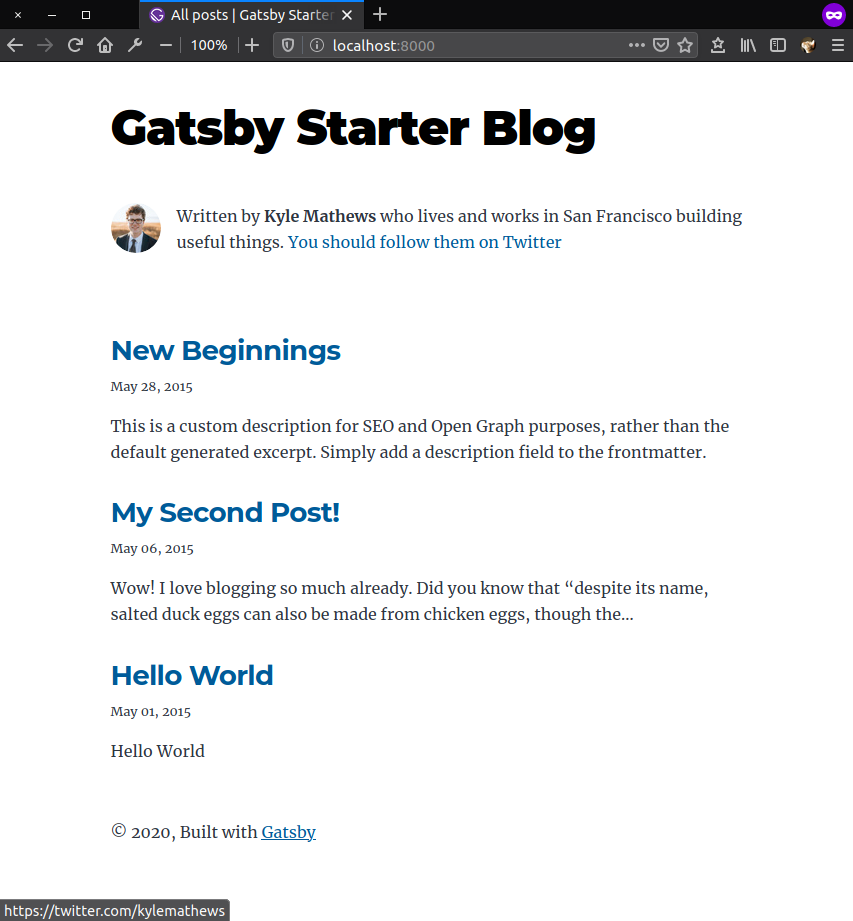
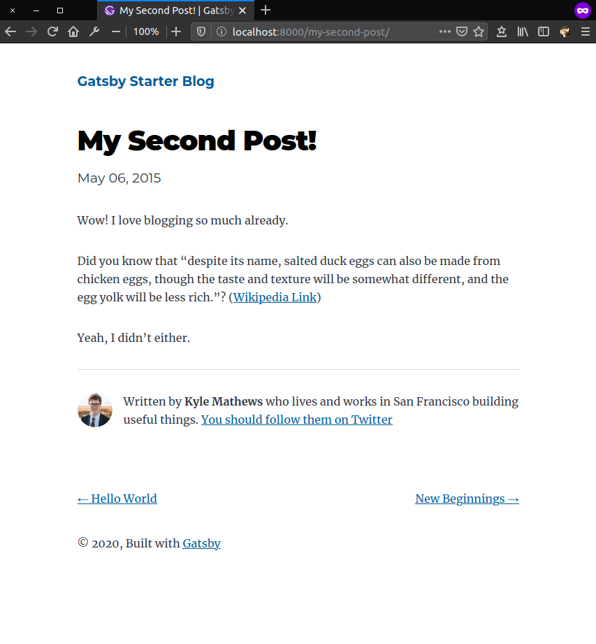

import Figcaption from "../../components/Figcaption"

There are many ways to serve static webpage and here I'll tell you on how to serve [Gatsby](https://www.gatsbyjs.com/) webpage using [Nginx](https://nginx.org/en/) on [Docker](https://www.docker.com/).


<Figcaption><span>Photo by <a href="https://unsplash.com/@msilvaphoto?utm_source=unsplash&amp;utm_medium=referral&amp;utm_content=creditCopyText">Murilo Silva</a> on <a href="https://unsplash.com/s/photos/engine-x?utm_source=unsplash&amp;utm_medium=referral&amp;utm_content=creditCopyText">Unsplash</a></span></Figcaption>

### Prepare the Webpage
Here I will use [Gatsby](https://www.gatsbyjs.com/) for build webpage and using [Gatsby Starter Blog](https://www.gatsbyjs.com/starters/gatsbyjs/gatsby-starter-blog) so we can shorten development time. Using [Gatsby CLI Tool](https://www.gatsbyjs.com/docs/gatsby-cli/) we can start developing webpage by running this command

```noLineNumbers
gatsby new webpage https://github.com/gatsbyjs/gatsby-starter-blog
```

Change into webpage directory then start the development mode

```noLineNumbers
cd webpage
gatsby develop
```

This command starts a development server and you will be able to see your new site in a development environment locally by open up your browser then navigate to `http://localhost:8000/`



<br />

You can make a change on the content of webpage by adding and/or editing components. Once finished, now you need to _generate_ static webpage using this command

```noLineNumbers
gatsby build
```

Gatsby `build` command produces a directory of static HTML, CSS and JavaScript files which you can deploy to a static site hosting services. Instead deploying to a static site hosting service, we will use Nginx to serve our static webpage.

### Configure Nginx
Next we need to create config file so Nginx can serve our webpage. Here is the simplest Nginx config file for serving Gatsby webpage

```:title=nginx.conf
user              nginx;
worker_processes  auto;

error_log         /var/log/nginx/error.log  warn;
pid               /var/run/nginx.pid;


events  {
    worker_connections  1024;
}


http  {
    include         /etc/nginx/mime.types;
    default_type    application/octet-stream;

    log_format      main  '$remote_addr - $remote_user [$time_local] "$request" '
                          '$status $body_bytes_sent "$http_referer" '
                          '"$http_user_agent" "$http_x_forwarded_for"';

    access_log      /var/log/nginx/access.log  main;

    
    server  {
        listen           80;
        root             /usr/share/nginx/html;
        server_tokens    off;


        location  /  {
            try_files  $uri  $uri/index.html  /index.html;
        }
    }
}
```

### Build an Image Docker
Now that we have nginx config file we can now create our `Dockerfile`.

```:title=Dockerfile
# build the webpage
FROM node:lts AS build

WORKDIR /usr/frontend

COPY ./package*.json ./

RUN npm ci --silent

COPY . .

RUN npm run build

# serve the static page using nginx
FROM nginx:stable-alpine

COPY --from=build /usr/frontend/public /usr/share/nginx/html

COPY nginx.conf /etc/nginx/nginx.conf
```

We use [multi-stage builds](https://docs.docker.com/develop/develop-images/multistage-build/) so we can reduce the docker image size. What we doing at first stage is we build the webpage using node image. And at last stage is we copy the result from previous stage so Nginx can serve that static webpage.

### That's all
And that's it how you using Nginx on Docker for serving Gatsby webpage. You can now build a Docker image and running it into Docker container.

```noLineNumbers
docker build -t webpage:latest .
docker run -d -p 80:80 --name my-webpage webpage:latest
```
